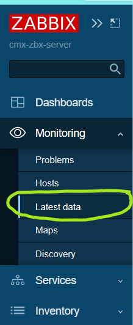
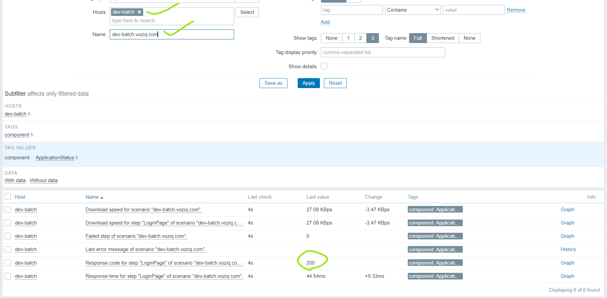

# Install and Configure Zabbix agent2 on ubuntu 20.04(focal).

## Step 1:

* visit official zabbix documentation and choose the zabbix version,os distribution,version,agent
* [Refer Here for official Zabbix documentation](https://www.zabbix.com/download?zabbix=6.4&os_distribution=ubuntu&os_version=20.04&components=agent_2&db=&ws=)


## Step 2:

* Install and configure zabbix agent2
  
### a. Install Zabbix repository
```
* wget https://repo.zabbix.com/zabbix/6.4/ubuntu/pool/main/z/zabbix-release/zabbix-release_6.4-1+ubuntu20.04_all.deb
* dpkg -i zabbix-release_6.4-1+ubuntu20.04_all.deb
* apt update
```

### b. Install Zabbix agent2

```
* apt install zabbix-agent2 zabbix-agent2-plugin-*
```
### c. Start Zabbix agent2 process

Start Zabbix agent2 process and make it start at system boot.

```
* systemctl restart zabbix-agent2
* systemctl enable zabbix-agent2
```
### d. check the status of zabbix-agent2
`service zabbix-agent2 status` this should be active and running.

## Step 3:

### a. Stop the zabbix agent by using `service zabbix-agent2 stop`
### b. Change the zabbix configuration file

* Open the conf file `vi /etc/zabbix/zabbix_agent2.conf`
* change the following server and server active with zabbix IP address and change the other options and save the file
  
  ```
  Server=127.0.0.1,172.16.3.34
  ServerActive=127.0.0.1,172.16.3.34
  EnablePersistentBuffer=1
  PersistentBufferPeriod=1h
  PersistentBufferFile=/disk1/voziq/voziq-monitoring/buffer.db

  ```

  ### step 4:

  * Now create the above files i.e voziq-monitoring/buffer.db
  
  ```
  mkdir /disk1/voziq/voziq-monitoring/
  chmod -R 777 /disk1/voziq/voziq-monitoring/
  chown -R zabbix:zabbix /disk1/voziq/voziq-monitoring
  touch 777 /disk1/voziq/voziq-monitoring/buffer.db
  ```

### Step 5: Now start and check the status of zabbix agent.

```
service zabbix-agent2 start
service zabbix-agent2 status
```


### step 4: configure host in zabbix server


* 1. click on create host and give the same hostname that you have given in agent configuration file.
  
* 2. choose the required templates based on the server you are configuring.
* 3. select the host group.
* 4. click on add interfaces and select agent and give the IP of the host and then add the macros and then save.


  
Now you can see in All hosts that the host you have created is shown in the list

### Step 5: Now head to zabbix server and click on monitoring and click on latest data



* Add agent hostname in host box and hit apply


* Now scroll down and check for the metrics, if the metrics are showing then the job is done.
* optionally if you are facing any problems you can check the logs at `/var/log/zabbix/zabbix_agent2.log`
  


## Frequently faced errors and their solutions

If you are facing errors like this while installing:

```

 One of the configured repositories failed (Oracle Linux / RHEL / CentOS-7 / x86_64 - VirtualBox),
 and yum doesn't have enough cached data to continue. At this point the only
 safe thing yum can do is fail. There are a few ways to work "fix" this:

     1. Contact the upstream for the repository and get them to fix the problem.

     2. Reconfigure the baseurl/etc. for the repository, to point to a working
        upstream. This is most often useful if you are using a newer
        distribution release than is supported by the repository (and the
        packages for the previous distribution release still work).

     3. Run the command with the repository temporarily disabled
            yum --disablerepo=virtualbox ...

     4. Disable the repository permanently, so yum won't use it by default. Yum
        will then just ignore the repository until you permanently enable it
        again or use --enablerepo for temporary usage:

            yum-config-manager --disable virtualbox
        or
            subscription-manager repos --disable=virtualbox

     5. Configure the failing repository to be skipped, if it is unavailable.
        Note that yum will try to contact the repo. when it runs most commands,
        so will have to try and fail each time (and thus. yum will be be much
        slower). If it is a very temporary problem though, this is often a nice
        compromise:

            yum-config-manager --save --setopt=virtualbox.skip_if_unavailable=true

failure: repodata/repomd.xml from virtualbox: [Errno 256] No more mirrors to try.
http://download.virtualbox.org/virtualbox/rpm/el/7/x86_64/repodata/repomd.xml: [Errno -1] repomd.xml signature could not be verified for virtualbox
```

* execute this command `yum --disablerepo=virtualbox` and then again start from where you stopped, this will help you.
* This majorly happens in CentOS machines.

2. After installation is completed and not able to see the agent active.

tips: check for firewall rule is on or off

* if `CentOS` use `sudo service firewalld status` if it active then stop the service.
* if it is a `UbuntuOS` use `s`udo service ufw status` f it active then stop the service.
* restart the agent and see the status it will be active.


## Now Adding templates and fetching metrics of webservers and applications.

* check for the service or application status, if it is present change the configuration file.

### If it is a nginx web-server.

#### step 1:
* Change the configuration file at location `/etc/nginx/conf.d/voziq-app.conf` and add the basic status parameter with zabbix server IP in it.
  
* 

#### step 2:
* Then restart the nginx server and check for the status. It should be in active(running state)
  
#### step 3:
* open the zabbix server and add the nginx related template and host by typing name and save.
* 
* Then go in to the `Monitoring->latest data` and search for the host and below in name section type nginx and look for the metrics are coming or not.
* 
* 
* Now you have configured nginx and fetched metrics successfully.

### If it is Voziq-app (Tomcat server)

* Voziq-app is run on apache-tomcat we application, so we have to change the tomcat configuration file.

#### step 1:
* Change the configuration file at location `/disk1/voziq/voziq-app/server/bin/setenv.sh` with the tomcat server IP in it.
* 
  
#### step 2:
* Then restart the `voziq-app` and check for the status. It should be in active(running state)

#### step 3:
* open the zabbix server and add the tomcat related template and host by typing name and save.
* we use `Genric java JMX` template for tomcat, because it fetches the tomcat and java related metrics aswell.
* 
* Then go in to the `Monitoring->latest data` and search for the host and below in name section type tomcat and look for the metrics are coming or not.
   Now you have configured tomcat and fetched metrics successfully.
* If having any issue you can find the logs at `/disk1/voziq/voziq-app/server/logs/catalina.2024-02-02.log`

## adding nginx log to host item

Step 1:

* nginx has 2 log files and we need to add them both to items. they ate
  1. access.log
  2. error.log
* location is `/var/log/nginx/access.log` and `/var/log/nginx/error.log`

step 2:

* now give nginx folder and the log files permission and give the ownership permissions.


```
chmod 755 /var/log/nginx/
chown -R zabbix:zabbix /var/log/nginx/

chmod 755 /var/log/nginx/access.log
chmod 755 /var/log/nginx/error.log

chown -R zabbix:zabbix /var/log/nginx/access.log
chown -R zabbix:zabbix /var/log/nginx/error.log
  ```

step 3:

* Now head to zabbix server and find the host and click on items section and on top right corner we can see the `create item` option


* Now add the log file name and give the log file path i.e `log[/var/log/nginx/access.log,,,,skip]` and `log[/var/log/nginx/error.log,,,,skip]`
* Add the tag as `Component` `log`


* Now click on  `Monitoring>Latestdata` Now check the latest data of the host using a keyword log in name section and check whether the metrics are coming or not
* 

* Same way add the log files of tomcat i.e `voziq-app` location of log file is 
* `chmod 755 /disk1/voziq/voziq-app/server/logs/catalina.out`
* `chown -R zabbix:zabbix /disk1/voziq/voziq-app/server/logs/catalina.out` and `elasticsearch` 

## Now adding the web scenarios for the hosts.

Step 1:

* Open zabbix server and click on the `web` option beside the host.

* Now click on the `create web scenario` option.

* Now give name for the web scenario as the `<hostname>.voziq.com` then add time interval and other options

* Then add `steps` section here give the name of the page when we login, like welcome page or login page and add the url of the page and give a `string` and click on add option.
  
  
  
* Now give the tags as `component` and value as `ApplicationStatus` then click on add.
  

* Now check in the `monitoring>latest-data` section and give hostname and give the webscenario name that you gave during webscenario configuring and hit apply, check whether the status code is showing `200` 
  
* Now you have successfully configured the web scenario.
